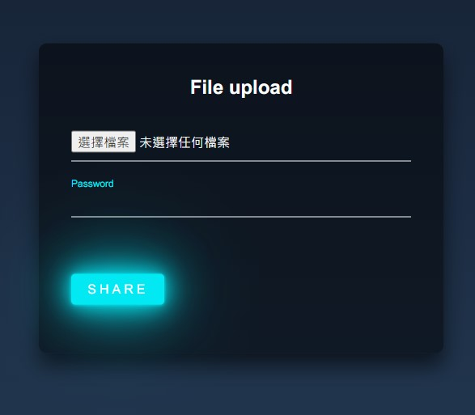
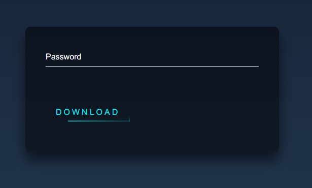

# File Sharing with Encryption

[](https://standardjs.com)

[Official site](https://file-upload-with-pwd.herokuapp.com/)

## Screenshot

#### Upload the file you would like to share. And you can choose to enter the password or not.



#### After clicking share button there will have a link.


#### Input the password you set then click download.



## Prerequisites

1. Node.js (v14.16.0 recommended)
2. GitBash or Cmder(Windows) / Terminal (Mac)

## Installation

1. Open your terminal, then clone the repo to your local.

```
git clone https://github.com/lcy101u/file-sharing-encrypt.git
```

2. Move to repo directory.

```
cd file-sharing-encrypt
```

3. Install dependencies.

```
npm install
```

## Execution

1. Start Express server in Node.js

```
npm run start
```

OR Start Express server in dev mode (By Nodemon)

```
npm run dev
```

2. Connect to http://localhost:3000
3. To quit from server

```
ctrl + c

```

### Contributor

[Young](https://github.com/lcy101u)
